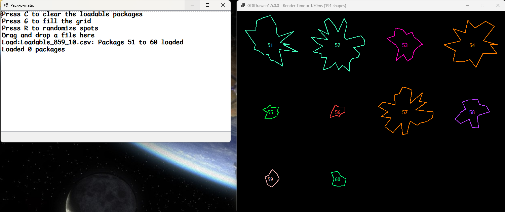

# Project Pack-o-matic

This application is an organizer. It will be able to load a text file comprised of vector based shapes. Taking these shapes it will attempt to place the shapes in a container. The shapes must not overlap and attempt to maximize the number of shapes that fit.
The placement algorithm is specified.

# `Package` Class Specification: 

## Overview

The `Package` class represents a geometric package defined by a polygon (list of points), a unique identifier, and a color. It provides functionality for drawing, collision detection, containment, and random placement within a graphical canvas.

---

## Members

| Member                | Type                | Access      | Description                                                                 |
|-----------------------|---------------------|-------------|-----------------------------------------------------------------------------|
| `_rnd`                | `Random`            | private static | Used for generating random positions for packages.                        |
| `_lines`              | `List<Point>`       | private     | Stores the vertices of the polygon representing the package shape.          |
| `_id`                 | `int`               | private     | Unique identifier for the package.                                          |
| `ID`                  | `int`               | public (read-only) | Exposes the package's unique identifier.                              |
| `_color`              | `Color`             | public (auto-property) | The color used to draw the package.                                 |
| `Location`            | `Point`             | public (auto-property) | The center point or location of the package on the canvas. The points
for this package are relative to this location when rendered.                  |

---

## Methods

| Method                        | Signature                                                                 | Description                                                                                                 |
|-------------------------------|--------------------------------------------------------------------------|-------------------------------------------------------------------------------------------------------------|
| **Constructor**               | `Package(string packageString)`                                                | Parses a string to initialize the package's ID, color, and polygon points. Throws exceptions on bad input or parsing errors.  |
| `Intersects`                  | returns a bool, accepting a `Package` instance                                         | Checks if this package's polygon intersects with another package's polygon. This method will leverage `LineIntersects()`                                 |
| `LineIntersects`     | `static` helper, returns a bool accepting LineAStart, LineAEnd, LineBStart, LineBEnd`     | Determines if two line segments intersect. Used internally for collision and containment checks. Citation required.           |
| `Draw`                        | returns nothing, accepts a `CDrawer`                                              | Draws the package's polygon and its ID onto the provided canvas. Use the location to define a `Rectangle` of size 1, then `Inflate` it to size 30, creating the centered
rectangle for use with `AddText` and the ID                                           |
| `NewLocation`                 | returns nothing, accepts a `CDrawer`                                       | Randomly assigns a new location to the package within the canvas bounds, ensuring it remains entirely in bounds of the `CDrawer`. Leverage `InBounds()`.     |
| `Inbounds`                    | returns a bool, accepts a `CDrawer`                                          | return true if the package's polygon is entirely within the canvas boundaries.                                   |
| `ContainsPackage`                    | returns a bool, accepting a `Package` instance           | return true if this package contains any part of another package's polygon using radial line intersection tests using the invoking Package. This method creates a collection of radial lines from the center to each vertex, if any part of another package's polygon lines intersect these radial lines, then the argument package must be inside the invoking package.|
| `Equals` | override `Equals` | Leverage the helper methods(see rubric) to determine if the package overlaps the supplied package argument. Appropriately complete `GetHashCode`|

---

# Project Specification: UI `Form` Class

## Overview

The `Form` class is the main form for the Pack-o-matic application. It provides a graphical interface for loading, displaying, and managing geometric packages on a canvas. Users can drag and drop package files, randomize package placement, fill the canvas by grid, and clear loaded packages using keyboard shortcuts.

---

## Members

| Member         | Type                    | Access         | Description                                                                 |
|----------------|-------------------------|----------------|-----------------------------------------------------------------------------|
| `_rnd`         | `Random`                | private static | Used for generating random values, such as for package placement.           |
| `_canvas`      | `CDrawer`               | private        | The drawing surface for rendering packages.                                 |
| `_packages`    | `List<Package>`         | private        | Stores all packages loaded from a file.                                     |
| `_loadable`    | `List<Package>`         | private        | Stores packages that have been successfully placed on the canvas.           |
| `_queue`       | `Queue<Package>`        | private        | Queue of packages waiting to be placed on the canvas.                       |
| `_numRequired` | `int`                   | private        | Number of packages to attempt to load in random placement mode.             |
| `iMaxTries`    | `int`                   | private        | Maximum number of attempts to place a package without overlap or out-of-bounds. |
| `Status`       | `ListBox` or `Datagridview` | UI | All status messages will be added to the top |

---

## Methods

| Method                | Signature                                      | Description                                                                                      |
|-----------------------|------------------------------------------------|--------------------------------------------------------------------------------------------------|
| **Constructor**       | `Form1()`                                      | Initializes the form, sets up event handlers, and creates the drawing canvas.                    |
| `Form1_DragDrop`      | `void Form1_DragDrop(object? sender, DragEventArgs e)` | Handles file drop events, loads packages from a file, and resets the canvas and queues.          |
| `Form1_DragEnter`     | `void Form1_DragEnter(object? sender, DragEventArgs e)` | Handles drag enter events, enabling file drop if the data is valid.                              |
| `Form1_KeyDown`       | `void Form1_KeyDown(object? sender, KeyEventArgs e)`    | Handles keyboard shortcuts for clearing, randomizing, and grid-filling package placement.        |

---

## Functional Use

- **Initialization:**
  - The constructor sets up the form's appearance, event handlers, and initializes the drawing canvas.

- **File Drag-and-Drop:**
  - Users can drag and drop a single file containing package definitions onto the form.
  - The `Form1_DragDrop` method reads the file, parses each line into a `Package`, and populates the `_packages` list and `_queue`.
  - The canvas and status list are updated to reflect the loaded packages.
  - All loaded packages will be displayed in the drawer, spaced to accommodate available packages - NO collision detection should be implemented - all packages should be shown.

- **Keyboard Shortcuts:**
  - **C (Clear):**  
    Clears the `_loadable` list, resets the canvas, and reloads the `_queue` from `_packages`.
  - **R (Randomize):**  
    From the queue, it will attempts to randomly place up to `_numRequired` packages on the canvas without overlap or containment, using up to `iMaxTries` attempts per package. Successfully placed packages are added to `_loadable` and shown.
  - **G (Grid Fill):**  
    Creating a grid of points ( 100x100 ) within the `CDrawer`, it will attempt to place each package from the queue at all grid points across the canvas, checking for valid placement (no overlap, containment, or out-of-bounds). Successfully placed packages are added to `_loadable` and shown.

- **Status Updates:**
  - The status list (`Status`) is updated throughout to inform the user of actions taken, errors, and results.

- **Canvas Rendering:**
  - After any change to the loadable packages, the canvas is cleared and all loadable packages are redrawn.

---

## User Interaction

- **Drag and Drop:**  
  Users can load a package file by dragging it onto the form.

- **Keyboard Controls:**  
  - `C`: Clear loadable packages and reset the queue.
  - `R`: Randomly place packages on the canvas.
  - `G`: Fill the canvas using a grid-based placement.

## Rubric and Completion

The lab may be completed with partial compliance for the marks indicated below :
| Functionality         | Mark  | Description                                                                                      |
|-----------------------|-------|--------------------------------------------------------------------------------------------------|
| Package Load/Show | 30 | Package class CTOR, Draw, NewLocation and InBounds complete. Must be able to load from file, and randomly place all available packages and show |
| Basic Collision Detection | 50 | Everything complete, except `ContainsPackage()` use |
| Full Collision Detection | 20 | Everything complete |

Notes : 
- Any rubric completion requires proper error processing, status output and output must be complete for that rubric.
